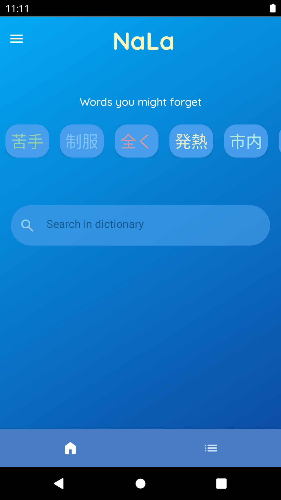
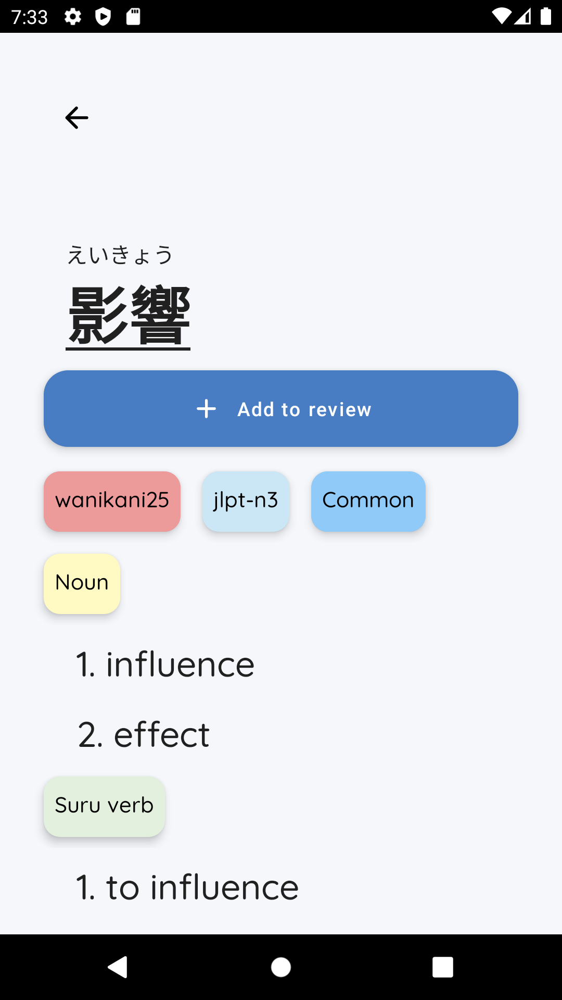
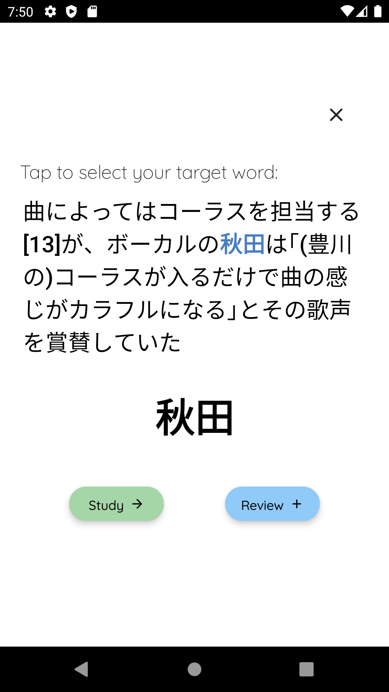
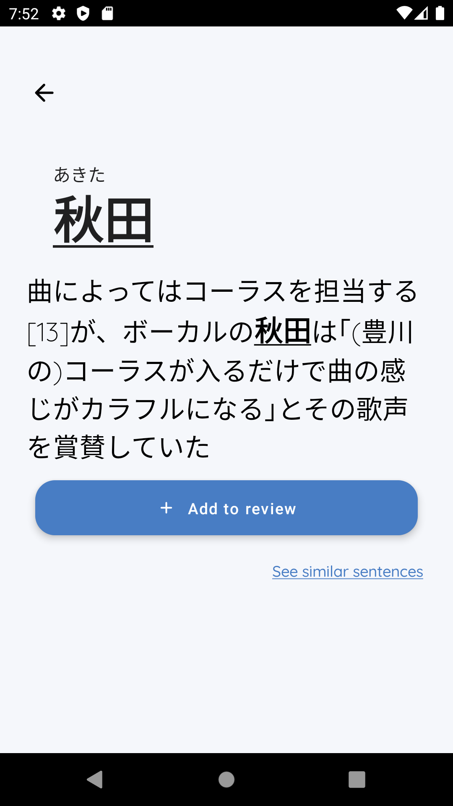
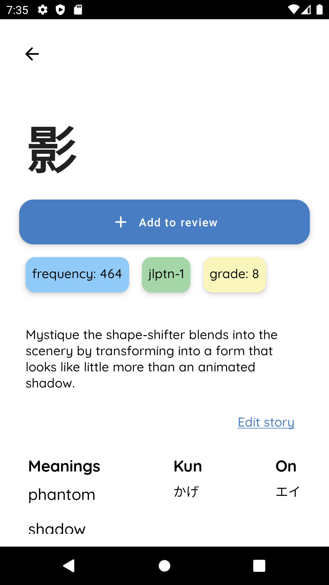
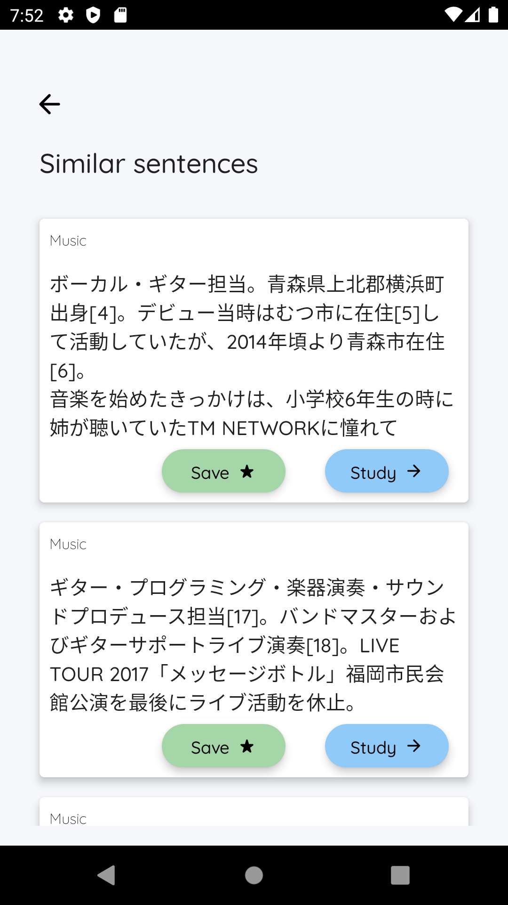
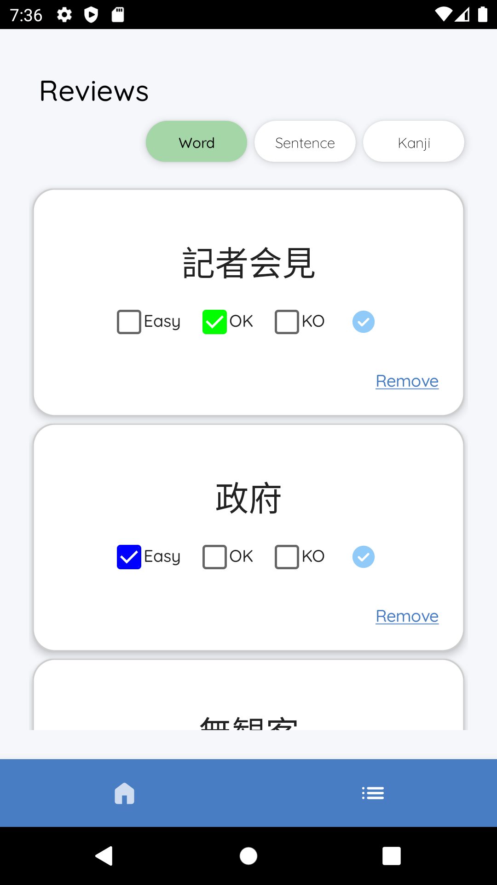
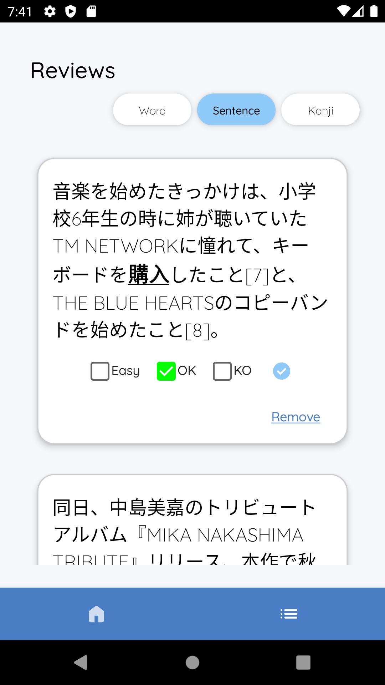
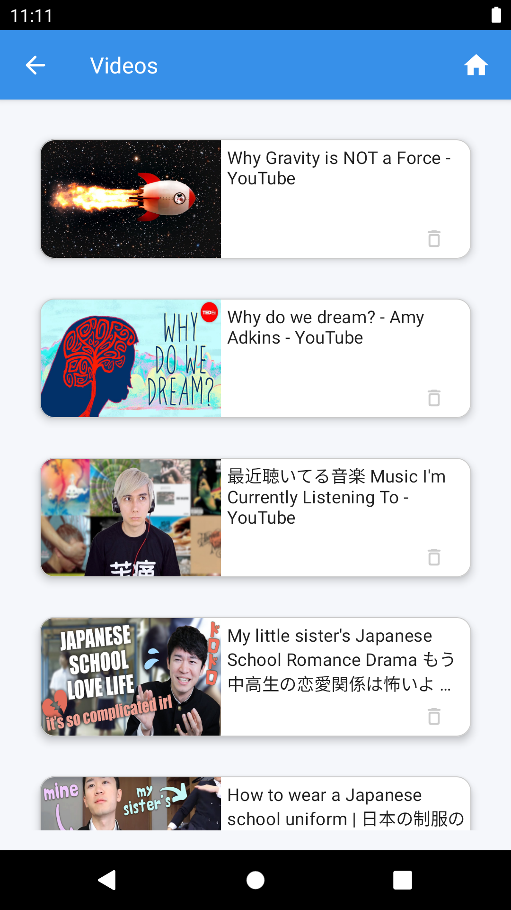

# NaLa - Japanese learning toolbox 

A simple Android app that offers a set of tools to make the life o japanese learners easier, from simple dictionary features to specific words, sentences and kanji learning and review features, with a little help from **Natural language processing** models.

 

The [Jetpack Toolkit](https://developer.android.com/jetpack) was used to build the app, including the new Jetpack Compose for the UI.

 

For the on-device neural language models, I used [pytorch mobile](https://pytorch.org/mobile/home/)

A [personal Web API](https://github.com/cr1m5onk1ng/semantic-search-api/tree/master) built with FastApi was used as a base for the semantic search service used in the app.
Working on an improved and more feature-rich version using AWS Lambda

The app makes also use of the incredibly useful [Jisho](https://jisho.org/) API for words lookup

 

## ✨ Features

- [x] Look up words in the dictionary
- [x] Search for a Japanese word everywhere on your phone
- [x] Add sentences with a target word to study/review them
- [x] Starting from a sentence, search for the most similar/dissimilar sentences
- [x] Automatically organize your sentences/documents by category/topic
- [ ] Find the most frequent words that use a certain kanji
- [ ] Search for semantically related words saved locally
- [ ] Share words/sentences with AnkiDroid
- [ ] Import articles and other media from the web
- [ ] OCR functionality for non-textual content

## 📸 Screenshots

Home
 ---------------------------------

| Word                             | Sentence                              |
| --------------------------------- | --------------------------------- |
|   |   |
|   |   |
|   |   |
|   |   |
|   |  |
|  |  | 

| Videos                             |
|   |   |
|   |   |
|   |   |

| Saved items                             |
|   |   |
## Author

**Mirco Cardinale**
[Personal website](https://mirco-cardinale-portfolio.herokuapp.com/)

## 🔖 LICENCE

[GPL](https://github.com/cr1m5onk1ng/nala_android_app/blob/dev/LICENSE)